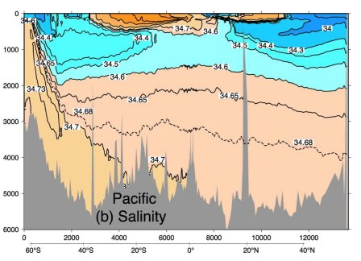

Fall 2017

  - Instructor: [Jody Klymak](http://web.uvic.ca/~jklymak)
  - Office: [Bob Wright Centre](http://www.uvic.ca/buildings/sci.html) A313
  - Tel: (250)-472-5969; Email: [jklymak@uvic.ca](mailto:jklymak@uvic.ca)
  - Office Hours:
  - Meeting time:  TWF 9:30-10:20
  - Location:  [Sci 121](http://www.uvic.ca/home/about/campus-info/maps/maps/sci.php)

## Course Objectives ##

The goal of this course is to familiarize students with how the ocean
moves and what forces cause it to move.  We will discuss wind-driven
circulation, buoyancy-driven circulation, and the tides.  Along the
way we will learn about the major current systems, water masses, and
how the ocean interacts with the atmosphere and climate.

## Schedule

<iframe width="600px" height="400px" src="https://docs.google.com/spreadsheets/d/e/2PACX-1vQVIgoOGtI46FDH_qxoUmOT7n_eEJ8NBPZAjfXxkE62VLiC5Fy8SbLp-pxuuYTVnU_bwHt-pbsdw1B4/pubhtml?gid=0&amp;single=true&amp;widget=true&amp;headers=false"></iframe>

## [Lectures](Lectures/)

## [Texts](Texts/)

Largely [Open University: Ocean Circulation](http://www.sciencedirect.com.ezproxy.library.uvic.ca/science/book/9780750652780) but also see [Texts](./Texts/).  

## [Course grading](Grading/)

## [Course Project](CourseProject/)

## [Labs](http://web.uvic.ca/~sarahjt/OSM/314Labs/)

## Course Evaluation Survey

These are filled out online at [ces.uvic.ca](http://ces.uvic.ca).  There should be a link to this course on your dashboard.

## Mailing list

Please feel free to contact me through the mailing lists:

[201709-eos314-11520@lists.uvic.ca](mailto:201709-eos314-11520@lists.uvic.ca)

[To manage your list](https://lists.uvic.ca/mailman/listinfo/201709-eos314-11520)

Questions that will benefit all your classmates are very welcome on
the list.
